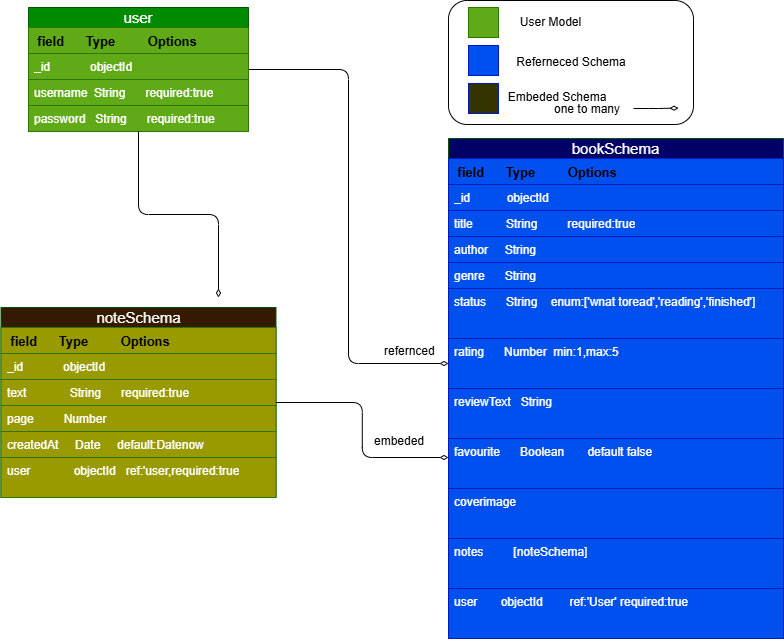
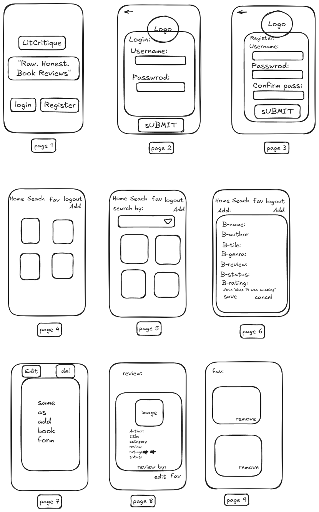

  

<h1 align="center">📚 LitCritique — Book Review App</h1>

  <em>A full-stack MEN (MongoDB, Express, Node.js) application for readers who love to write, share, and discover book reviews.</em>

  <a href="https://litcritique-g1ho.onrender.com/"><strong>🔗 Live Demo</strong></a>

---

## 📖 About the Project

**LitCritique** is a full-stack book review platform built on the **MEN stack** (MongoDB, Express.js, Node.js) with server-rendered EJS views. It gives readers a personal, social space to log in, add their own book reviews, browse what everyone else is reading, and leave short reading notes on any book at any page.

The idea behind LitCritique is simple: reviews shouldn't just be a star rating and a paragraph they should feel alive. That's why, beyond the standard **Create, Read, Update, and Delete (CRUD)** functionality for books, the app also supports:

- 📝 **Adding a full book review** title, author, genre, status, cover image, and personal thoughts.
- ✏️ **Editing and deleting your own reviews** you stay fully in control of the content you post; no one else can touch it.
- ⭐ **Favoriting books** save the books you love (or want to remember) to your own personal favorites list for quick access later.
- 🔍 **Searching and filtering** find books instantly by title, author, genre, or reading status using a dedicated search page.
- 💬 **Reading notes**  any logged-in user can drop a quick note on any book (e.g. "This twist on page 120 changed everything!"), and can delete only the notes they personally wrote.
- 🔐 **Authentication**  secure sign up, login, and logout so every review, favorite, and note is tied to the right user.

Every book cover image is uploaded and served through **Cloudinary**, so the app stays fast and images are optimized automatically regardless of the original upload size. The interface is styled with custom CSS paired with **Google Fonts** for clean, readable typography throughout the site  from the landing page to the book detail view.

The app is fully deployed and hosted live on **Render**, so it's accessible from anywhere without any local setup.

---

## 🌐 Live Deployment

🔗 **Live site:** [https://litcritique-g1ho.onrender.com/](https://litcritique-g1ho.onrender.com/)

📁 **GitHub repo:** [https://github.com/EshaAbbasi/LitCritique](https://github.com/EshaAbbasi/LitCritique.git)

The app is deployed and hosted live on **[Render](https://render.com)**, connected directly to this GitHub repository for continuous deployment — every push to the main branch automatically redeploys the latest version of the site.

---

## 🛠️ Tech Stack

### Backend
- **Node.js** — JavaScript runtime powering the server
- **Express.js** — web framework handling routing, middleware, and controllers
- **MongoDB** — NoSQL database storing users, books, and embedded notes
- **Mongoose** — ODM used to model data and enforce schema structure/validation

### Frontend / Views
- **EJS (Embedded JavaScript)** — server-rendered templating engine for all views
- **CSS** — custom styling for a clean, book-shelf inspired layout
- **Google Fonts** — used throughout the app for consistent, readable typography

### Authentication & Session
- **bcrypt** — password hashing for secure user credentials
- **express-session** — session-based authentication so users stay logged in
- **Middleware guards** — protect routes so only logged-in users can add/edit/delete content, and only owners can edit/delete their own books and notes

### Media & Storage
- **Cloudinary** — cloud-based image hosting and optimization for all uploaded book cover images
- **Multer** (with `multer-storage-cloudinary`) — handles image upload from forms and streams them directly to Cloudinary

### Attributions

This project uses the following external resources:

- **[Google Fonts](https://fonts.google.com/)** — typography used throughout the app, including the logo

- **[Coolors](https://coolors.co/)** — color palette generation

- **[Goodreads](https://www.goodreads.com/shelf/show/book-reviews)** — book cover images

- **[Canva](https://www.canva.com/)** — background image on the home screen

- **[Pinterest](https://www.pinterest.com/)** — images used on the sign-up page/login page
### Deployment & Tools
- **Render** — cloud hosting platform used for live deployment of the app
- **MongoDB Atlas** — cloud-hosted database used in production
- **dotenv** — environment variable management for API keys and database URIs
- **Git & GitHub** — version control and source hosting

---

## User stories

- As a **guest**, I want to sign up for an account so that I can start reviewing books.
- As a **guest**, I want to log in so that I can access my account.
- As a **logged-in user**, I want to see a list of all book reviews from every user so that I can discover new books.
- As a **logged-in user**, I want to search/filter books by title, author, genre, or status so that I can quickly find the review I'm looking for.
- As a **logged-in user**, I want to add a new book review, including a cover image, so that I can share my thoughts.
- As a **logged-in user**, I want to edit or delete only my own book reviews so that I stay in control of my own content.
- As a **logged-in user**, I want to favorite books so that I can build my own personal reading list.
- As a **logged-in user**, I want to add a reading note to any book so that I can share a thought at a specific page.
- As a **logged-in user**, I want to delete only the notes I personally wrote so that others' notes stay intact.
- As a **logged-in user**, I want to log out so that my session ends securely.

---

## ERD (Entity Relationship Diagram)

- **User → Book**: one-to-many, referenced. Each book stores a `user` field (foreign key) pointing to its owner.
- **Book → Note**: one-to-many, embedded. Notes are stored directly inside each book's `notes` array.
- **User → Note**: one-to-many, referenced. Each embedded note stores its own `user` field, since any logged-in user can add a note to any book.

---

## Wireframes

Pages included:
1. Landing page
2. Login
3. Sign up
4. Books index (home) — navbar includes a **Search** link alongside Home, Favorites, and Add
5. Search / filter books — accessed from the Search link in the navbar; filters the books index by title, author, genre, or status via query string
6. Add a book (new)
7. Edit a book
8. Book detail / review (show)
9. Favorites

---

## RESTful routes

### Auth routes

| HTTP method | Path | Purpose |
|---|---|---|
| GET | `/auth/sign-up` | Render sign-up form |
| POST | `/auth/sign-up` | Create a new user |
| GET | `/auth/sign-in` | Render login form |
| POST | `/auth/sign-in` | Log in a user |
| POST | `/auth/sign-out` | Log out the current user |

### Book routes

| HTTP method | Path | CRUD | Purpose |
|---|---|---|---|
| GET | `/books` | index | Show all books from all users |
| GET | `/books?q=&status=&genre=` | index (filtered) | Search/filter books by title, author, genre, or status (query string, same controller as index; reached via the navbar Search link) |
| GET | `/books/new` | new | Render form to add a book |
| POST | `/books` | create | Create a new book (owner = current user) |
| GET | `/books/:bookId` | show | Show a single book's details, review, and notes |
| GET | `/books/:bookId/edit` | edit | Render edit form (owner only) |
| PUT | `/books/:bookId` | update | Update a book (owner only) |
| DELETE | `/books/:bookId` | delete | Delete a book (owner only) |

### Note routes (nested under Book)

| HTTP method | Path | CRUD | Purpose |
|---|---|---|---|
| POST | `/books/:bookId/notes` | create | Add a note to a book (any logged-in user) |
| DELETE | `/books/:bookId/notes/:noteId` | delete | Delete a note (author only) |

---

## 🔮 Future Enhancements

- Star-rating system with average review scores per book
- Comment threads on individual reading notes
- Public reading profiles for each user
- Genre-based recommendation engine
- Dark mode toggle

---

## 👤 Author

Built with ☕ and a lot of late-night reading by **[Esha Ashfar]**.

- GitHub: [@EshaAbbasi](https://github.com/EshaAbbasi)
